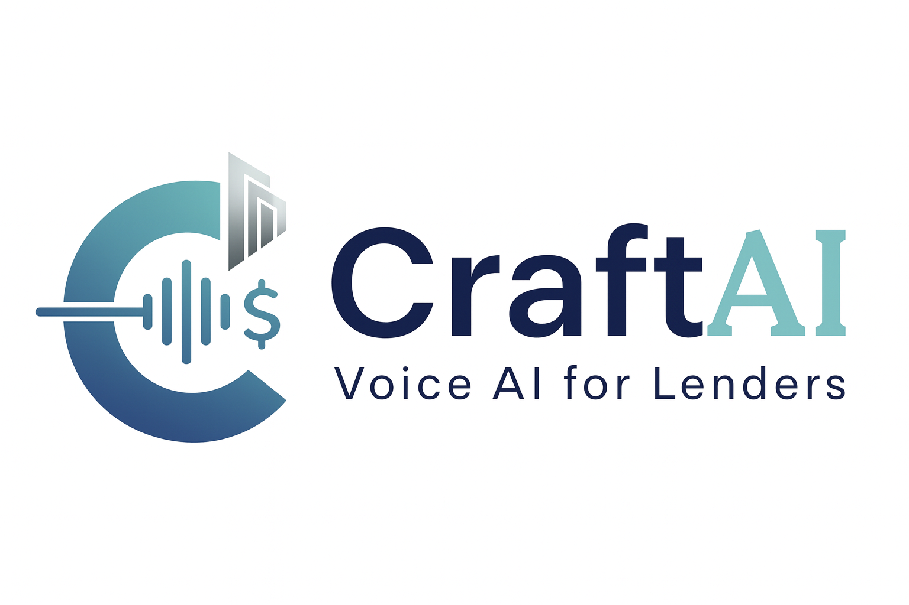

# CraftAI - Voice AI Platform for Lenders

<div align="center">



**Transform Your Lending Operations with Intelligent Voice AI**

[](https://react.dev/)
[](https://www.typescriptlang.org/)
[](https://vite.dev/)
[](https://tailwindcss.com/)

[Live Demo](#demo-feature) • [Features](#features) • [Getting Started](#getting-started) • [Documentation](#documentation)

</div>

---

## Overview

CraftAI is a cutting-edge Voice AI platform designed specifically for lending institutions. Scale your lending operations with higher recoveries and lower costs through intelligent AI voice agents, ML-driven strategies, and real-time analytics.

### Key Highlights

- **500K+ Calls Completed** - Proven at scale
- **3x Higher On-Time Payments** - Measurable impact
- **100% Compliant** - FDCPA, TCPA compliant
- **70% Cost Reduction** - Operational efficiency

---

## Features

### 🤖 AI-Powered Voice Agents

Meet our specialized AI agents designed for different lending scenarios:

| Agent | Role | Specialization |
|-------|------|----------------|
| **Priya** | Lead Generation | Calls leads and gauges interest through intelligent questioning |
| **Tripti** | EMI Reminder | Reminds customers of upcoming EMIs and educates on timely payments |
| **Arun** | Debt Collection | Professional negotiation and payment recovery post-bounce |

### 📊 Real-Time Analytics

- **Live Call Metrics** - Track contactability rates, call duration, and success rates
- **Interactive Dashboards** - Visualize promise-to-pay rates, intent scoring, and risk indicators
- **Behavioral Insights** - ML-powered analysis of customer payment patterns

### ⚡ Advanced Capabilities

- **Context-Aware Conversations** - AI understands past interactions and adapts strategies
- **Omnichannel Outreach** - Coordinated strategy across voice, WhatsApp, SMS, RCS, and email
- **Smart Prioritization** - AI scoring to focus on high-value accounts
- **Compliance Automation** - Built-in regulatory compliance

---

## Tech Stack

### Frontend Framework
- **React 19.1.1** - Latest React with hooks and functional components
- **TypeScript 5.9.3** - Strict type safety with modern ES2022+ features
- **Vite 7.1.7** - Lightning-fast build tool and dev server

### UI & Styling
- **shadcn/ui** - High-quality UI components built on Radix UI primitives
- **Tailwind CSS** - Utility-first CSS framework
- **Framer Motion** - Smooth animations and transitions
- **Lucide React** - Beautiful icon library

### API Integration
- **Bolna Voice AI** - Enterprise-grade voice AI platform for making outbound calls
- **REST API** - Clean API integration with error handling

### Development Tools
- **ESLint** - Code quality and consistency
- **TypeScript ESLint** - Type-aware linting
- **Vite Plugin React** - Fast refresh and optimized builds

---

## Project Architecture

```
CraftAI/
├── src/
│   ├── assets/
│   │   └── images/          # Logo, agent avatars, partner logos
│   │       ├── logo.png
│   │       ├── arun.png     # Debt collection agent
│   │       ├── priya.png    # Lead generation agent
│   │       ├── tripti.png   # EMI reminder agent
│   │       ├── shubham.png
│   │       ├── heroHousing.png
│   │       └── srgHousing.png
│   │
│   ├── component/
│   │   ├── ui/              # shadcn/ui components (40+ components)
│   │   │   ├── button.tsx
│   │   │   ├── card.tsx
│   │   │   ├── input.tsx
│   │   │   ├── label.tsx
│   │   │   └── ... (accordion, dialog, dropdown, etc.)
│   │   │
│   │   ├── AnalyticsAnimation.tsx  # Real-time metrics visualization
│   │   ├── CallPulse.tsx           # Call status animation
│   │   ├── DemoPage.tsx            # Live demo interface
│   │   ├── HomePage.tsx            # Landing page
│   │   └── Navigation.tsx          # Main navigation
│   │
│   ├── App.tsx              # Root component with routing
│   ├── App.css              # Application styles
│   ├── main.tsx             # Application entry point
│   └── index.css            # Global styles & Tailwind imports
│
├── .env                     # Environment variables (API keys)
├── package.json             # Dependencies and scripts
├── tsconfig.json            # TypeScript configuration
├── vite.config.ts           # Vite configuration
└── README.md                # This file
```

### Component Architecture

#### Pages
- **HomePage** - Marketing landing page with features, benefits, and client testimonials
- **DemoPage** - Interactive demo with agent selection and live call initiation
- **Navigation** - Responsive navigation bar with page routing

#### Animations
- **AnalyticsAnimation** - Animated bar chart showing Promise to Pay, Risk Indicators, Intent to Pay, and Ability to Pay
- **CallPulse** - Visual representation of active call with radio wave effects

#### UI Components
Built with **shadcn/ui** for consistency and accessibility:
- Forms: Button, Input, Label, Checkbox, Radio, Select, Switch
- Layout: Card, Dialog, Sheet, Tabs, Accordion
- Feedback: Alert, Toast (Sonner), Progress, Skeleton
- Navigation: Navigation Menu, Dropdown Menu, Context Menu
- Data Display: Table, Badge, Avatar, Tooltip

---

## Getting Started

### Prerequisites

- **Node.js** 18.x or higher
- **npm** or **yarn** package manager
- **Bolna API Account** - Sign up at [Bolna.ai](https://bolna.ai)

### Installation

1. **Clone the repository**
   ```bash
   git clone https://github.com/yourusername/craftai.git
   cd craftai
   ```

2. **Install dependencies**
   ```bash
   npm install
   ```

3. **Configure environment variables**

   Create a `.env` file in the root directory:
   ```env
   # Bolna API Configuration
   VITE_BOLNA_API_KEY=your_api_key_here

   # Agent IDs (get from Bolna dashboard)
   VITE_BOLNA_AGENT_PRIYA=priya-agent-uuid
   VITE_BOLNA_AGENT_TRIPTI=tripti-agent-uuid
   VITE_BOLNA_AGENT_ARUN=arun-agent-uuid

   # Phone Number Configuration
   VITE_BOLNA_FROM_PHONE=+919876543007
   ```

4. **Start the development server**
   ```bash
   npm run dev
   ```

5. **Open your browser**

   Navigate to `http://localhost:5173`

---

## Environment Variables

| Variable | Description | Required |
|----------|-------------|----------|
| `VITE_BOLNA_API_KEY` | Bolna API authentication key | ✅ Yes |
| `VITE_BOLNA_AGENT_PRIYA` | UUID for Priya agent | ✅ Yes |
| `VITE_BOLNA_AGENT_TRIPTI` | UUID for Tripti agent | ✅ Yes |
| `VITE_BOLNA_AGENT_ARUN` | UUID for Arun agent | ✅ Yes |
| `VITE_BOLNA_FROM_PHONE` | Outbound caller ID phone number | ✅ Yes |

### Getting Bolna Credentials

1. Create an account at [Bolna.ai](https://bolna.ai)
2. Navigate to **API Settings** to get your API key
3. Create voice agents in the Bolna dashboard
4. Copy each agent's UUID to your `.env` file
5. Configure your outbound phone number

---

## Available Scripts

```bash
# Start development server with hot reload
npm run dev

# Build for production
npm run build

# Preview production build locally
npm run preview

# Run ESLint for code quality checks
npm run lint

# Type check TypeScript files
npx tsc --noEmit
```

### Build Output

Production builds are optimized and output to the `dist/` directory:
- Minified JavaScript bundles
- Optimized CSS
- Compressed assets
- Source maps for debugging

---

## Component Overview

### Main Pages

#### HomePage Component
[src/component/HomePage.tsx](src/component/HomePage.tsx)

The landing page showcases:
- Hero section with value proposition
- Feature cards with icons and descriptions
- "How It Works" workflow visualization
- Client testimonials with partner logos
- Call-to-action sections

**Key Features:**
- Framer Motion animations on scroll
- Responsive grid layouts
- Gradient effects and modern design
- Navigation to demo page

#### DemoPage Component
[src/component/DemoPage.tsx](src/component/DemoPage.tsx)

Interactive demo interface that:
- Accepts phone number input
- Displays three AI agent options with descriptions
- Initiates real voice calls via Bolna API
- Shows call status with animations
- Displays execution ID and call duration

**Technical Implementation:**
```typescript
// Call flow
User enters phone → Selects agent → API call to Bolna →
Call queued → Connection established → Call in progress → Call ended
```

#### Navigation Component
[src/component/Navigation.tsx](src/component/Navigation.tsx)

Responsive navigation bar with:
- Logo and branding
- Page navigation (Home, Demo, About, Contact)
- Call-to-action buttons
- Mobile-responsive design

### Animation Components

#### AnalyticsAnimation
[src/component/AnalyticsAnimation.tsx](src/component/AnalyticsAnimation.tsx)

Real-time animated chart displaying:
- **Promise to Pay** - Boolean indicator
- **Risk Indicators** - Job loss, financial distress
- **Intent to Pay** - High/Medium/Low scoring
- **Ability to Pay** - Financial capacity assessment

Features shimmer effects and color-coded metrics (green for positive, red for negative, amber for warnings).

#### CallPulse
[src/component/CallPulse.tsx](src/component/CallPulse.tsx)

Visual representation of an active call with:
- Animated radio waves (left and right)
- Pulsing phone icon
- Glow effects
- Smooth transitions

---

## Demo Feature

### How the Live Demo Works

1. **User Input**
   - Enter a valid phone number (with country code)
   - Select one of three AI agents based on use case

2. **Agent Selection**
   - **Priya** - Best for lead qualification and interest gauging
   - **Tripti** - Ideal for payment reminders and customer education
   - **Arun** - Professional debt collection and negotiation

3. **Call Initiation**
   ```typescript
   // API Payload
   {
     agent_id: "selected-agent-uuid",
     recipient_phone_number: "+919876543210",
     from_phone_number: "+919876543007",
     user_data: {
       agent_name: "Priya",
       call_type: "lead_generation",
       demo_mode: "true"
     }
   }
   ```

4. **Call Flow**
   - API request to `https://api.bolna.ai/call`
   - Call queued with execution ID
   - Connection established (2-3 seconds)
   - Live call with AI agent
   - Call metrics displayed in real-time

5. **Post-Call Analytics**
   - Call duration
   - Execution ID for tracking
   - Success/failure status

---

## Code Style & Best Practices

### TypeScript
- **Strict mode enabled** - No implicit `any`, full type safety
- **Type inference** preferred over explicit typing
- **Interface-first** approach for props and data structures

### React
- **Functional components** with hooks (no class components)
- **Custom hooks** for reusable logic
- **React.memo** used sparingly for performance bottlenecks
- **Prop destructuring** for cleaner code

### Component Structure
```typescript
// Standard component pattern
interface ComponentProps {
  prop1: string;
  prop2?: number;
}

export function Component({ prop1, prop2 = 0 }: ComponentProps) {
  const [state, setState] = useState<StateType>(initialValue);

  // Component logic

  return (
    <div>
      {/* JSX */}
    </div>
  );
}
```

### Naming Conventions
- **Components**: PascalCase (e.g., `DemoPage`, `CallPulse`)
- **Files**: PascalCase for components (e.g., `HomePage.tsx`)
- **Functions**: camelCase (e.g., `makeCall`, `formatDuration`)
- **Constants**: UPPER_SNAKE_CASE (e.g., `API_BASE_URL`)

---

## API Integration

### Bolna Voice AI

**Endpoint:** `https://api.bolna.ai/call`

**Authentication:** Bearer token in headers

**Request Example:**
```typescript
const response = await fetch("https://api.bolna.ai/call", {
  method: "POST",
  headers: {
    "Authorization": `Bearer ${VITE_BOLNA_API_KEY}`,
    "Content-Type": "application/json"
  },
  body: JSON.stringify({
    agent_id: "agent-uuid",
    recipient_phone_number: "+919876543210",
    from_phone_number: "+919876543007",
    user_data: { /* custom data */ }
  })
});
```

**Response Example:**
```json
{
  "status": "queued",
  "execution_id": "exec-123-abc-456",
  "message": "Call initiated successfully"
}
```

**Error Handling:**
- Network errors
- Invalid credentials (401)
- Rate limiting (429)
- Invalid phone numbers (400)

---

## Deployment

### Build for Production

```bash
# Create optimized production build
npm run build

# Test production build locally
npm run preview
```

### Deployment Platforms

#### Vercel (Recommended)
```bash
# Install Vercel CLI
npm i -g vercel

# Deploy
vercel
```

#### Netlify
```bash
# Install Netlify CLI
npm i -g netlify-cli

# Deploy
netlify deploy --prod --dir=dist
```

#### GitHub Pages
```bash
# Build with correct base path
npm run build -- --base=/repository-name/

# Deploy to gh-pages branch
npm run deploy
```

### Environment Variables in Production

Ensure all `VITE_*` environment variables are set in your hosting platform:
- Vercel: Project Settings → Environment Variables
- Netlify: Site Settings → Build & Deploy → Environment
- GitHub Pages: Repository Settings → Secrets and variables → Actions

---

## Performance Optimization

### Code Splitting
Vite automatically splits code by routes and dynamic imports.

### Lazy Loading
```typescript
// Lazy load components
const DemoPage = lazy(() => import('./component/DemoPage'));
```

### Image Optimization
- Use WebP format for better compression
- Implement lazy loading for images below the fold
- Use appropriate image sizes for different screen resolutions

### Bundle Size
Current production bundle (approximate):
- Main chunk: ~150KB (gzipped)
- Vendor chunk: ~180KB (gzipped)
- Total: ~330KB (gzipped)

---

## Browser Support

- Chrome (latest)
- Firefox (latest)
- Safari (latest)
- Edge (latest)
- Mobile browsers (iOS Safari, Chrome Android)

**Note:** IE11 is not supported due to modern JavaScript features.

---

## Troubleshooting

### Common Issues

**Issue:** Development server won't start
```bash
# Clear node_modules and reinstall
rm -rf node_modules package-lock.json
npm install
```

**Issue:** Environment variables not loading
```bash
# Ensure .env file is in project root
# Restart dev server after changing .env
# Variables must start with VITE_
```

**Issue:** TypeScript errors
```bash
# Check TypeScript version
npx tsc --version

# Run type checking
npx tsc --noEmit
```

**Issue:** Bolna API calls failing
- Verify API key is correct
- Check agent UUIDs exist in Bolna dashboard
- Ensure phone numbers include country code
- Check network connectivity

---

## Contributing

We welcome contributions! Please follow these guidelines:

1. **Fork the repository**
2. **Create a feature branch** (`git checkout -b feature/amazing-feature`)
3. **Commit your changes** (`git commit -m 'Add amazing feature'`)
4. **Push to the branch** (`git push origin feature/amazing-feature`)
5. **Open a Pull Request**

### Code Review Process
- All PRs require review before merging
- Ensure tests pass and no TypeScript errors
- Follow existing code style and conventions
- Update documentation if needed

---

## License

This project is proprietary and confidential. Unauthorized copying, distribution, or use is strictly prohibited.

**Copyright © 2025 CraftAI. All rights reserved.**

---

## Contact & Support

- **Website:** [craftai.com](https://craftai.com)
- **Email:** support@craftai.com
- **Demo:** [Try Live Demo](https://craftai.com/demo)
- **Documentation:** [Full Documentation](https://docs.craftai.com)

---

## Acknowledgments

### Technologies
- [React](https://react.dev/) - UI framework
- [Vite](https://vite.dev/) - Build tool
- [shadcn/ui](https://ui.shadcn.com/) - UI components
- [Tailwind CSS](https://tailwindcss.com/) - Styling
- [Framer Motion](https://www.framer.com/motion/) - Animations
- [Bolna AI](https://bolna.ai/) - Voice AI platform

### Partners
- Shubham Housing Finance
- Hero Housing Finance
- SRG Housing Finance Limited

---

<div align="center">

**Built with ❤️ by the CraftAI Team**

[⬆ Back to Top](#craftai---voice-ai-platform-for-lenders)

</div>
